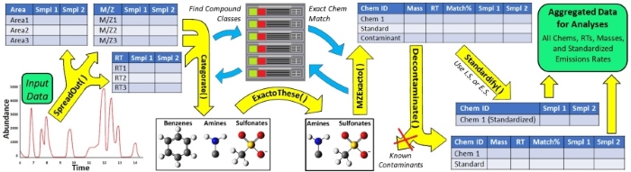

# <span style="color: rgba(104, 0, 96, 1); font-size:120%; background-color: rgba(0, 0, 0, 0)">Automated GC/MS data processing</span>

***
<span style="color: purple; font-size:215%; background:none">Nothing in life is to be feared; it is only to be understood.</span>   
<span style="color: black; font-size:200%; background:none">--Marie Curie</span>


***



```{css, echo = F}
pre code {
  white-space: pre-wrap;
}
```

```{r, include = FALSE}
knitr::opts_chunk$set(
  collapse = TRUE,
  comment = "#>"
)
```

```{r setup, include = FALSE}
# library(uafR)
standard_input = read.csv("standard_data.csv", stringsAsFactors = F)
standard_spread = readRDS("standard_spread.rds")
type_lib = read.csv("type_library.csv")
query_categ = readRDS("query_categorated.rds")
standard_categ = readRDS("standard_categorated.rds")
```

## <span style="color: rgba(104, 0, 96, 1); font-size:120%; background-color: rgba(0, 0, 0, 0.01)">Hello [Chemical] World!</span>

|        <span style="color: black; font-size:115%; background:inherit">Chemistry plays an active role in every aspect of human existence. Whether it be the digested molecules of our food, the solid matrices of plastic and metal that comprise our technology, or the macromolecules that build and run our cells, the compositions are all chemical. To understand this aspect of our existence, there are advanced instruments and techniques that identify chemicals of any system to name. These precise instruments also allow the number of molecules for each individual chemical to be quantified across analyzed samples. While the output from these machines is immediately available, preparing the raw output for interpretive statistics can require hours/days of trained labor per sample and months per experiment.  </span>
|  
|        <span style="color: black; font-size:115%; background:inherit">To remove the bottleneck that exists between the acquisition of raw mass spectrometry output and the interpretation of chemicals across experimental treatments, we have developed advanced algorithms that automate the entire process. Ours is the first GC/MS utility that accesses published information for every tentative compound to intelligently select portions of each sample that describe user-specified query chemicals. This information makes uafR the most accurate and advanced post-GC/MS processing application to date.</span>

## <span style="color: rgba(104, 0, 96, 1); font-size:120%; background-color: rgba(0, 0, 0, 0.01)">New Standard, Mass Spectrometry Workflows</span>
### <span style="color: rgba(104, 0, 96, 1); font-size:120%; background-color: rgba(0, 0, 0, 0)">Input Data Structure</span>
|        <span style="color: black; font-size:115%; background:inherit">The original workflow for uafR was developed using Agilent instruments and software. The recommended software for generating the necessary data in the default format (i.e. with correct column names) is [Unknowns Analysis](https://www.agilent.com/cs/library/usermanuals/public/G3335-90187_Unknowns_Analysis_Familiarization-en.pdf). That said, any software or utility that generates the necessary information can be used with simple modifications (e.g. changing the column names).</span>

```{r, echo = F}
# options(width = 1000)
# standard_input[c(38:43),]
```

 Component.RT  |  Base.Peak.MZ    |  Component.Area  |       Compound.Name        |  Match.Factor  |  Sample.Name  
:-------------:|:----------------:|:----------------:|:---------------------------|:--------------:|:------------:
8.229034       |84.00             |906.4701          |Pipradrol                   |62.62271        |Std_soln_07    
8.286703       |120.00            |209705.1878       |Methyl salicylate           |98.16152        |Std_soln_00a    
8.296408       |119.99            |30332.9022        |Methyl salicylate           |95.79911        |Std_soln_00    
8.303958       |120.00            |6476.4785         |Methyl salicylate           |86.29569        |Std_soln_07    
8.348031       |105.00            |420.8119          |3-Hexen-1-ol, benzoate, (Z)-|68.78156        |Std_soln_00    
**...**        |**...**           |**...**           |**...**                     |**...**         |**...**         


### <span style="color: rgba(104, 0, 96, 1); font-size:120%; background-color: rgba(0, 0, 0, 0)">Spread It Out</span>
|        <span style="color: black; font-size:115%; background:inherit">The first step in the process is to convert the raw input to a format that downstream functions can work with. `spreadOut()` prepares the read in .CSV for intelligent ***sorting*** (using retention times and published masses) then ***aggregation*** (using all published names and top m/z peaks) of sample portions that describe a chemical. A list containing all necessary information for the next function, `mzExacto()`, is returned.</span>
|        <span style="color: black; font-size:115%; background:inherit">Contents of the list include matrices (here focused on methyl salicylate) that store:  </span>
  
1. <span style="color: black; font-size:115%; background:inherit">**chemical names**</span>
```{r, echo = F}
# standard_spread$Compounds[c(38:43),]
```
Sample_1                    |  Sample_2       |  Sample_3  
:--------------------------:|:---------------:|:----------------:
\<NA\>                      |Pipradrol        |\<NA\>      
\<NA\>                      |\<NA\>           |Methyl salicylate     
Methyl salicylate           |\<NA\>           |\<NA\>    
\<NA\>                      |Methyl salicylate|\<NA\>      
3-Hexen-1-ol, benzoate, (Z)-|\<NA\>           |\<NA\>        
**...**                     |**...**          |**...**           


2. <span style="color: black; font-size:115%; background:inherit">**retention times**</span>
```{r, echo = F}
# standard_spread$RT[c(38:43),]
```
Sample_1       |  Sample_2       |  Sample_3  
:-------------:|:---------------:|:-----------:
\<NA\>         |8.229033559      |\<NA\>      
\<NA\>         |\<NA\>           |8.286703432     
8.296408204    |\<NA\>           |\<NA\>    
\<NA\>         |8.303958027      |\<NA\>      
8.348031108    |\<NA\>           |\<NA\>        
**...**        |**...**          |**...**           

3. <span style="color: black; font-size:115%; background:inherit">**match factors**</span>
```{r, echo = F}
# standard_spread$MatchFactor[c(38:43),]
```
Sample_1       |  Sample_2       |  Sample_3  
:-------------:|:---------------:|:-----------:
\<NA\>         |62.62271472      |\<NA\>      
\<NA\>         |\<NA\>           |98.16152088     
95.79911297    |\<NA\>           |\<NA\>    
\<NA\>         |86.29569222      |\<NA\>      
68.78156469    |\<NA\>           |\<NA\>        
**...**        |**...**      |**...**             

4. <span style="color: black; font-size:115%; background:inherit">**captured M/Z value**</span>
```{r, echo = F}
# standard_spread$MZ[c(38:43),]
```
  Sample_1     |  Sample_2       |  Sample_3  
:-------------:|:---------------:|:-----------:
\<NA\>         |84               |\<NA\>      
\<NA\>         |\<NA\>           |120      
119.99         |\<NA\>           |\<NA\>    
\<NA\>         |120              |\<NA\>      
105            |\<NA\>           |\<NA\>        
**...**        |**...**          |**...**       

5. <span style="color: black; font-size:115%; background:inherit">**exact mass data (if published)**</span>
```{r, echo = F}
# standard_spread$Mass[c(38:43),]
```
Sample_1       |  Sample_2       |  Sample_3  
:-------------:|:---------------:|:-----------:
\<NA\>         |267.162314293    |\<NA\>      
\<NA\>         |\<NA\>           |152.047344113     
152.047344113  |\<NA\>           |\<NA\>    
\<NA\>         |152.047344113    |\<NA\>      
204.115029749  |\<NA\>           |\<NA\>        
**...**        |**...**          |**...**         

6. <span style="color: black; font-size:115%; background:inherit">**raw area values**</span>
```{r, echo = F}
# standard_spread$Area[c(38:43),]
```
Sample_1       |  Sample_2       |  Sample_3  
:-------------:|:---------------:|:-----------:
\<NA\>         |906.4700739      |\<NA\>      
\<NA\>         |\<NA\>           |209705.1878     
30332.90221    |\<NA\>           |\<NA\>    
\<NA\>         |6476.478451      |\<NA\>      
420.8119135    |\<NA\>           |\<NA\>        
**...**        |**...**          |**...**       

7. <span style="color: black; font-size:115%; background:inherit">**a unique code for each input data point (retention time pasted to exact mass)**</span>
```{r, echo = F}
# options(width = 200)
# standard_spread$rtBYmass[c(38:43),]
```
Sample_1                    |  Sample_2                       |  Sample_3  
:--------------------------:|:-------------------------------:|:--------------------------:
\<NA\>                      |8.229033559 \| 267.162314293     |\<NA\>      
\<NA\>                      |\<NA\>                           |8.286703432 \| 152.047344113     
8.296408204 \| 152.047344113|\<NA\>                           |\<NA\>    
\<NA\>                      |8.303958027 \| 152.047344113     |\<NA\>      
8.348031108 \| 204.115029749|\<NA\>                           |\<NA\>        
**...**                     |**...**                          |**...**             

8. <span style="color: black; font-size:115%; background:inherit">**and a nested list with**:   </span>

+ <span style="color: black; font-size:115%; background:inherit">*all published chemical names* (only first 5 are shown)</span>
```{r, echo = F}
standard_spread$webInfo$`Methyl salicylate`[[1]][1:5]
```
+ <span style="color: black; font-size:115%; background:inherit">*top m/z peaks*</span>
```{r, echo = F}
standard_spread$webInfo$`Methyl salicylate`[[2]][1:5]
```
+ <span style="color: black; font-size:115%; background:inherit">*exact mass*</span>
```{r, echo = F}
standard_spread$webInfo$`Methyl salicylate`[[3]]
```
+ <span style="color: black; font-size:115%; background:inherit">*and likely retention times for the query chemicals.*</span>
```{r, echo = F}
standard_spread$webInfo$`Methyl salicylate`[[4]]
```

### <span style="color: rgba(104, 0, 96, 1); font-size:120%; background-color: rgba(0, 0, 0, 0)">Extract Your Chemicals</span>
|        <span style="color: black; font-size:115%; background:inherit">The output from `spreadOut()` is like a searchable chemical database where each entry has every published, uniquely identifying feature assigned to it. `mzExacto()` collects the same information for a set of query chemicals and uses it to precisely search the advanced dictionary for samples that have those chemicals. </span> 
|        <span style="color: black; font-size:115%; background:inherit">In many cases, users will already know what they are looking for. In others, they won't. </span>
  
***
#### <span style="color: rgba(104, 0, 96, 1); font-size:120%; background-color: rgba(0, 0, 0, 0)">When Chemicals are Known </span>
|        <span style="color: black; font-size:115%; background:inherit">While there are multiple ways to create a list of input chemicals [see `personalLib()`], a simple method for smaller searches is to just type quotes around the search names in a list:</span>

```{r, echo = F}
query_chemicals = c("Ethyl hexanoate", "Methyl salicylate", "Octanal", "Undecane")
```
<span style="color: black; font-size:135%; background:inherit"> **`query_chemicals = c("Ethyl hexanoate", "Methyl salicylate", "Octanal", "Undecane")`** </span>
```{r, echo = F}
# print(query_chemicals)
```

<span style="color: black; font-size:115%; background:inherit">`mzExacto()` takes the output from spreadOut() [`standard_spread`] and this list of `query_chemicals`: </span> 
  
```{r, echo = F}
mzExacto_print = paste0("mzExacto(standard_spread, query_chemicals)")

# print(mzExacto_print)
```
<span style="color: black; font-size:135%; background:inherit"> **`mzExacto(standard_spread, query_chemicals)`** </span>  
  
<span style="color: black; font-size:115%; background:inherit">returning a single dataframe with all of the necessary information for downstream functions and, ultimately, interpretation.</span>

Compound          |Mass         |RT         |Best Match |Std_soln_00 |Std_soln_07|Std_soln_00a
------------------|-------------|-----------|-----------|------------|-----------|-------------
Octanal           |128.120115130|5.462089753|99.32456762|379178.88653|30943.11385|125725.8982
Ethyl hexanoate   |144.115029749|5.379718874|99.35011811|263866.0427 |9896.488149|294869.1357
Methyl salicylate |152.047344113|8.295689887|98.16152088|30332.90221 |6476.478451|209705.1878
Undecane          |156.187800766|6.129191467|98.6771852 |86270.05019 |243.9123731|238776.2287

***
#### <span style="color: rgba(104, 0, 96, 1); font-size:120%; background-color: rgba(0, 0, 0, 0)">When Types/Classes of Chemicals are Known </span>
|        <span style="color: black; font-size:115%; background:inherit">`categorate()` is an overpowered function that accesses a broad array of categorical data for searched chemicals. Here we present a single application from the output of `categorate()` that could help in GC/MS analyses where classes/types of chemical groupings are known, but not specific compounds. For a detailed overview of additional chemistry workflows (e.g. meta-analyses) that `categorate()` could catalyze, we recommend the companion manuscript (linked when published).</span>
|        <span style="color: black; font-size:115%; background:inherit">A required input for running `categorate()` is a library to perform structural matches against. This library is a .CSV file that can contain as many sets of chemicals as the user's hardware can handle. For the following example, we have restricted our search to 4 sets of chemicals that we know are structurally similar to our query chemicals from the previous section (Types B, C, D, and E below) and one set that should not have any matches (Type A).</span>
  
Type.A                                        |Type.B                |Type.C   |Type.D            |Type.E
:---------------------------------------------|:---------------------|:--------|:-----------------|:-------------
2-Aminothiazole                               |o-Cresol              |Nonane   |Butyl methacrylate|Octane
3,4,5,6-Tetrachlorocyclohexene                |Salicylic Acid        |Dodecane |Isobutyl hexanoate|Octanoic acid
N-methyl-1,3,5-triazin-2-amine                |Guaiacol              |Tridecane|Ethyl heptanoate  |1-Octanol
2-Methyloctahydro-2-azacyclopropa[cd]pentalene|Aspirin               |<NA>     |Methyl hexanoate  |Hexadecanal
<NA>                                          |Salicyl alcohol       |<NA>     |Methyl heptanoate |Decanal
<NA>                                          |4-Methylsalicylic acid|<NA>     |Dihexyl adipate   |Undecanal
<NA>                                          |<NA>                  |<NA>     |2-Heptanone       |Hexyl acetate
  
  
|        <span style="color: black; font-size:115%; background-color: rgba(0, 0, 0, 0)"> To perform the chemical structure matches and summarize atomic features, uafR taps into an amazing set of cheminformatics packages -- [ChemmineR](https://www.bioconductor.org/packages/release/bioc/html/ChemmineR.html), [fmcsR](https://bioconductor.org/packages/release/bioc/html/fmcsR.html), [webchem](https://cran.r-project.org/web/packages/webchem/index.html). The library tests return the following data frames:</span>  
```{r, echo = F}
# query_categ$FunctionalGroups
# query_categ$BestChemMatch
```

Type.A| Type.B| Type.C| Type.D| Type.E|Chemical
:----:|:-----:|:-----:|:-----:|:-----:|----------------------------------:
No    |No     |No     |Yes    |~      |ethyl hexanoate
No    |Yes    |No     |No     |No     |methyl salicylate
No    |No     |~      |~      |Yes    |octanal
No    |No     |Yes    |~      |Yes    |undecane

  
|        <span style="color: black; font-size:115%; background:inherit">Where "No" means none of the chemicals had a structural match, "~" refers to at least 1 match between 0.85 and 0.95, and "Yes" means there was at least 1 match exceeding 0.95.</span>
  
Type.A| Type.B| Type.C| Type.D| Type.E|Chemical
:----:|:-----:|:-----:|:-----:|:-----:|----------------------------------:
No    |No     |No     |CMP2   |No     |ethyl hexanoate
No    |CMP1   |No     |No     |No     |methyl salicylate
No    |No     |No     |No     |CMP1   |octanal
No    |No     |CMP1   |No     |CMP1   |undecane

|        <span style="color: black; font-size:115%; background:inherit">Where the first compound in a set that had a match exceeding 0.95 is shown. The number following "CMP" refers tells the user which compound was a match (i.e. 1 refers to the topmost chemical in the group), so ethyl hexanoate was more structurally similar to isobutyl hexanoate than butyl methacrylate. Makes sense!</span>
|        <span style="color: black; font-size:115%; background:inherit">As can be seen, our library did a great job pulling out the chemicals of interest from the previous example. However, some studies may have even less direction to go off of. In these cases, the atomic/functional group summary provided by [fmcsR](https://bioconductor.org/packages/release/bioc/html/fmcsR.html) can also help navigate:</span>
```{r, echo = F}
# options(width = 200)
# FMCS_df = query_categ$FMCS[!duplicated(query_categ$FMCS),-c(2,3,4)]
# FMCS_df[c(1,3,5,13,15,17,25,27,29,37,39,41),]
# 
# FMCS_df_all = query_categ$FMCS[!duplicated(query_categ$FMCS),]
# FMCS_df_all
```

Chemical          |Groups   |GroupCounts   |Atom    |AtomCounts     |NCharges
:-----------------|:-------:|:------------:|:------:|:-------------:|:-------:
ethyl hexanoate   |RCOOH    |0             |H       |16             |0
ethyl hexanoate   |RCOOR    |1             |O       |2              |0
ethyl hexanoate   |ROR      |0             |C       |8              |0
methyl salicylate |ROH      |1             |H       |8              |0
methyl salicylate |RCOOR    |1             |O       |3              |0
methyl salicylate |RCOR     |0             |C       |8              |0
octanal           |ROH      |0             |H       |16             |0
octanal           |RCHO     |1             |O       |1              |0
octanal           |RCOR     |0             |C       |8              |0
undecane          |RCHO     |0             |H       |24             |0
undecane          |RCOR     |0             |C       |11             |0

|        <span style="color: black; font-size:115%; background:inherit">This is only a subset of the output from this utility/function meant to emphasize some of the more useful results. The actual output includes columns for the molecular weight, molecular formula, presence/absence of rings (cyclical carbon groups), and additional common functional groups including those with phosporous or nitrogen. </span>
|        <span style="color: black; font-size:115%; background:inherit">Getting back to the GC/MS workflow, subsetting the `query_chemicals` with these outputs is very easily achieved using `exactoThese()`:</span>

`query_chemicals = exactoThese(chems_categorated, subsetBy = "Database", subsetArgs = c("LOTUS", "FEMA"))`
`query_chemicals = exactoThese(input_categorated, subsetBy = "FMCS", subsetArgs = "MW", subsetArgs2 = "Between", subset_input = c(50,115))`

***
#### <span style="color: rgba(104, 0, 96, 1); font-size:120%; background-color: rgba(159, 160, 255, 0.1)">Unknown Exploration</span>
|        <span style="color: black; font-size:115%; background:inherit">As referenced, `categorate()` casts a broad net for categorical information on query chemicals. This internet...net uses regular expressions to pull published data from a variety of databases. Captured information can include:</span>
  
<span style="color: black; font-size:115%; background:inherit">1. Reactive Groups from [PubChem](https://pubchem.ncbi.nlm.nih.gov/),</span>
```{r, echo = F}
options(width = 100)
# query_categ$Databases[,-c(1,5)]
PubChem_df = data.frame(standard_categ$Databases[standard_categ$Databases$Chemical %in% query_chemicals,c(1,6)])
PubChem_df2 = PubChem_df[!duplicated(PubChem_df),]
PubChem_df2[-7,]
```
<span style="color: black; font-size:115%; background:inherit">2. natural products occurrences from [LOTUS](https://lotus.naturalproducts.net/),</span>
```{r, echo = F}
options(width = 100)
# query_categ$Databases[,-c(1,5)]
LOTUS_df = data.frame(standard_categ$Databases[standard_categ$Databases$Chemical %in% query_chemicals,c(2,6)])
LOTUS_df[!duplicated(LOTUS_df),]
```
<span style="color: black; font-size:115%; background:inherit">3. bioactivites and risk categories from the Kyoto Encyclopedia of Genes and Genomes ([KEGG](https://www.genome.jp/kegg/)),</span>
```{r, echo = F}
options(width = 100)
# query_categ$Databases[,-c(1,5)]
KEGG_df = data.frame(standard_categ$Databases[standard_categ$Databases$Chemical %in% query_chemicals, c(3,6)])
KEGG_df[!duplicated(KEGG_df),]
```
<span style="color: black; font-size:115%; background:inherit">4. flavors, odors, etc. from the Flavor and Extract Manufacturers Association ([FEMA](https://www.femaflavor.org/)),</span>
```{r, echo = F}
options(width = 100)
# query_categ$Databases[,-c(1,5)]
FEMA_df = data.frame(standard_categ$Databases[standard_categ$Databases$Chemical %in% query_chemicals,c(4,6)])
FEMA_df[!duplicated(FEMA_df),]
```
<span style="color: black; font-size:115%; background:inherit">5. and whether it exists in the Food and Drug Administration's SPL data base ([FDA/SPL](https://www.fda.gov/)).</span>
```{r, echo = F}
options(width = 100)
# query_categ$Databases[,-c(1,5)]
FDA_df = data.frame(standard_categ$Databases[standard_categ$Databases$Chemical %in% query_chemicals,c(5,6)])
FDA_df[!duplicated(FDA_df),]
```

|        <span style="color: black; font-size:115%; background:inherit">While this output shows the chemicals from the first search (known chemicals), this example is based on the assumption that we do not know what we will find across every sample. The compounds are the focus for this portion of the example only for clarity and data continuity. In this alternate, unknown context, a useful approach for narrowing the search chemicals for `categorate()` and/or `mzExacto()` is to first subset by match factor:  </span>
<span style="color: black; font-size:135%; background:inherit"> `query_chems = standard_dat$Compound.Name[standard_dat$Match.Factor >= 65]`</span>

  
|        <span style="color: black; font-size:115%; background:inherit">At this match factor, the example input data structure would change to:  </span>

 Component.RT  |  Base.Peak.MZ    |  Component.Area  |       Compound.Name        |  Match.Factor  |  Sample.Name  
:-------------:|:----------------:|:----------------:|:---------------------------|:--------------:|:------------:
\<NA\>         |\<NA\             |\<NA\>            |\<NA\>                      |\<NA\>          |\<NA\>      
8.286703       |120.00            |209705.1878       |Methyl salicylate           |98.16152        |Std_soln_00a    
8.296408       |119.99            |30332.9022        |Methyl salicylate           |95.79911        |Std_soln_00    
8.303958       |120.00            |6476.4785         |Methyl salicylate           |86.29569        |Std_soln_07    
8.348031       |105.00            |420.8119          |3-Hexen-1-ol, benzoate, (Z)-|68.78156        |Std_soln_00    
**...**        |**...**           |**...**           |**...**                     |**...**         |**...**          
  
|        <span style="color: black; font-size:115%; background:inherit">Which still leaves some "junk" that our analysis would probably be better without. To remedy this, we could - 1) `categorate()` all of the chemicals (`Compound.Name`) at this `Match.Factor` then subset by some feature(s); or, 2) continue to adjust the `Match.Factor` until the data make more chemical sense.</span> 


<span style="color: black; font-size:135%; background:inherit"> `query_chems = standard_dat$Compound.Name[standard_dat$Match.Factor >= 80]`</span>
  
  
|        <span style="color: black; font-size:115%; background:inherit">This match factor yields:  </span>

 Component.RT  |  Base.Peak.MZ    |  Component.Area  |       Compound.Name        |  Match.Factor  |  Sample.Name  
:-------------:|:----------------:|:----------------:|:---------------------------|:--------------:|:------------:
\<NA\>         |\<NA\             |\<NA\>            |\<NA\>                      |\<NA\>          |\<NA\>      
8.286703       |120.00            |209705.1878       |Methyl salicylate           |98.16152        |Std_soln_00a    
8.296408       |119.99            |30332.9022        |Methyl salicylate           |95.79911        |Std_soln_00    
8.303958       |120.00            |6476.4785         |Methyl salicylate           |86.29569        |Std_soln_07    
\<NA\>         |\<NA\             |\<NA\>            |\<NA\>                      |\<NA\>          |\<NA\>      
**...**        |**...**           |**...**           |**...**                     |**...**         |**...**         

|        <span style="color: black; font-size:115%; background:inherit">While it may seem as though all is well from this fraction of the data, it is important to remember that it is only a peek at what is lost or gained from the `Match.Factor` adjustments. To emphasize this point, consider what is lost by this adjustment:</span>

<span style="color: black; font-size:135%; background:inherit"> `query_chems = standard_dat$Compound.Name[standard_dat$Match.Factor >= 90]`</span>

|        <span style="color: black; font-size:115%; background:inherit">The high level of stochasticity behind every data point in a mass spectrometry analysis is another reason previous algorithms fail when assigning area values across samples. ***Hopefully*** more simply put -- with chemicals, things don't always go exactly the same. While this has historically driven manual over data-driven workflows, it could also be argued that it drives subjectivity into chemical analysis. Modern programming languages allow even complex workflows to be automated. By accessing published information we are able to mirror the optimal manual workflow for chemicals that were either misread in a sample or buried by similarities. This allows razor-sharp precision when excising from "gray" regions of the data.  </span>
|        <span style="color: black; font-size:115%; background:inherit">In this example, the known chemicals were found simply by sub-setting with `Match.Factor`:</span>

<span style="color: black; font-size:135%; background:inherit"> `query_chems = standard_dat$Compound.Name[standard_dat$Match.Factor > 89]`</span>

<span style="color: black; font-size:135%; background:inherit"> `mzExacto(standard_spread, query_chems)`</span>


Compound          |Mass         |RT         |Best Match |Std_soln_00 |Std_soln_07|Std_soln_00a
:-----------------|------------:|----------:|----------:|-----------:|----------:|------------:
Octanal           |128.120115130|5.462089753|99.32456762|379178.88653|30943.11385|125725.8982
Ethyl hexanoate   |144.115029749|5.379718874|99.35011811|263866.0427 |9896.488149|294869.1357
Methyl salicylate |152.047344113|8.295689887|98.16152088|30332.90221 |6476.478451|209705.1878
Undecane          |156.187800766|6.129191467|98.6771852 |86270.05019 |243.9123731|238776.2287

|        <span style="color: black; font-size:115%; background:inherit">But, the combined `Match.Factor` and `categorate()` approach can churn through a large amount of complex chemical data faster and with more accuracy than any manual protocol for unknown compound selections.</span>
  
***
